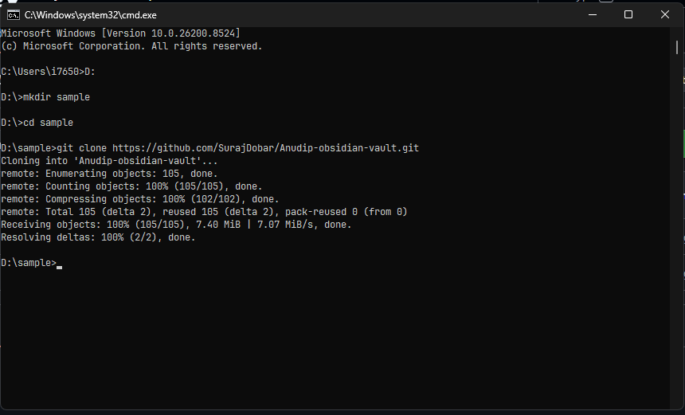
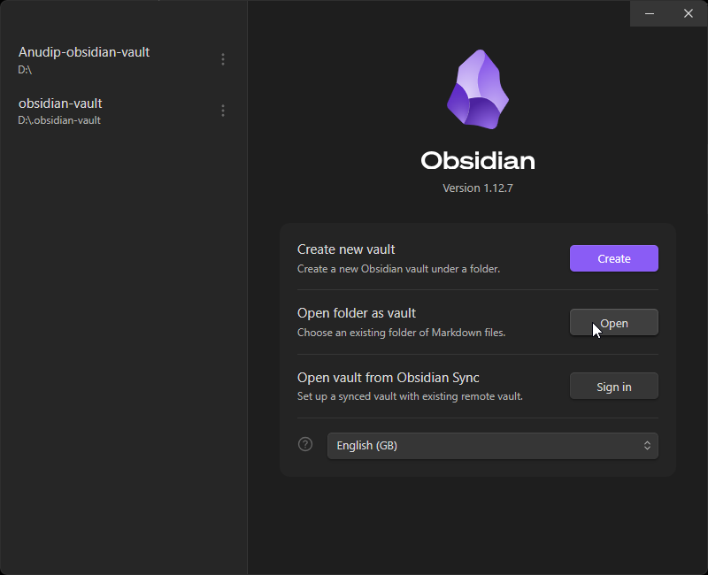
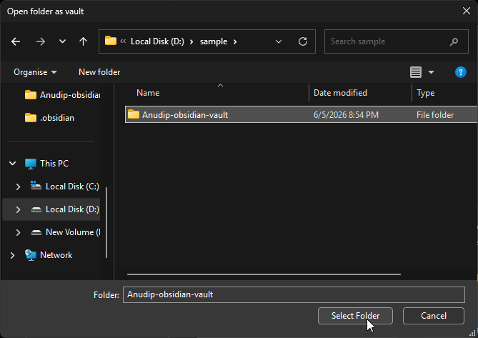
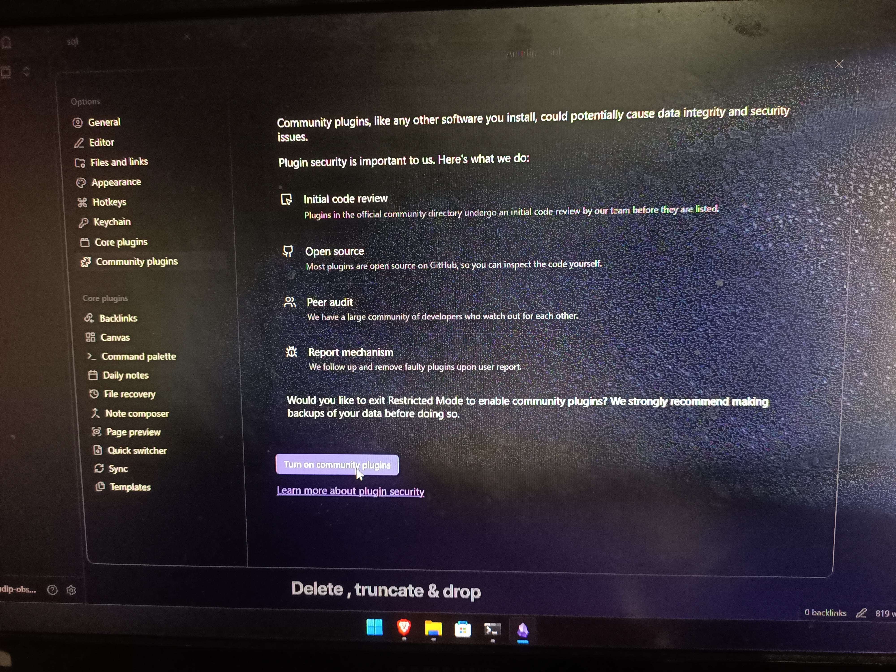
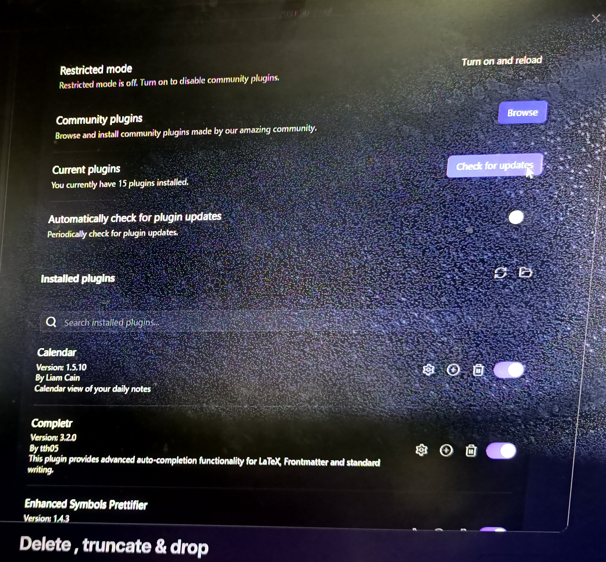

1. install obsidian on your device 
```
https://obsidian.md/download
```

2. open cmd
	.copy this and paste it in a drive where u can easily find it 

```
git clone https://github.com/SurajDobar/Anudip-obsidian-vault.git
```

Example:




3. open obsidian 

4. go into open folder as vault 


5. select the cloned file as shown (only the Anudip-obsidian-vault)


6. go to settings and community plugins then turn on community plugins




7. check for updates if any 

